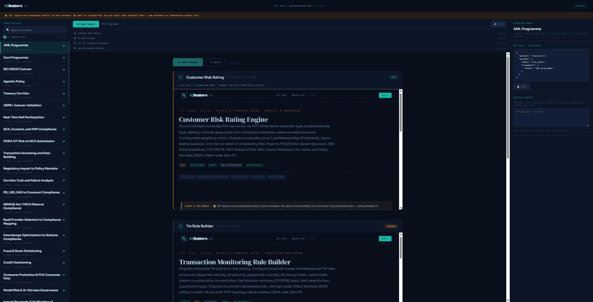

# AINumbers.co: Fintech Intelligence Suite

<!-- rce-round3-proof-a: scratch merge-queue proof, deleted after use -->


[](https://github.com/PostOakLabs/ainumbers/actions/workflows/deploy-to-dreamhost.yml)
[](https://creativecommons.org/licenses/by/4.0/)

Fintech compliance calculations get done by hand, in spreadsheets, or inside a vendor black box with no way to check the work. AINumbers.co gives payments engineers, ops teams, treasury analysts, and compliance professionals 500+ deterministic browser tools plus ChainGraph: an open standard where every calculation emits a reproducible hash, so any output can be independently re-verified instead of trusted on faith.

Built by [Post Oak Labs](https://postoaklabs.com). [Live Suite](https://ainumbers.co) · [MCP Server](https://ainumbers.co/mcp.html) · [ChainGraph Standard](https://ainumbers.co/chaingraph/openchain-graph-spec.html)



## Try it

- **Run a tool:** open [any tool page](https://ainumbers.co) directly. Single self-contained HTML file, no install, no account.
- **Run a chain:** [Workbench](https://ainumbers.co/chaingraph/workbench/workbench.html), pick a chain from the catalog, run it, verify the resulting hash.
- **Connect an agent:** point any MCP host at `https://mcp.ainumbers.co/mcp`. Docs at [ainumbers.co/mcp.html](https://ainumbers.co/mcp.html).

Counts drift as tools ship. Never trust a hardcoded number here or anywhere else in this repo. Live figures: `node scripts/counts.mjs` (site) and [`mcp-apps-poc/data/counts.json`](https://github.com/PostOakLabs/ainumbers-mcp-apps/blob/master/data/counts.json) (MCP server).

## What this is

A privacy-first, deterministic tool suite spanning 32 fintech categories: AML/KYC, cross-border payments, DLT/tokenization, treasury, embedded finance, e-invoicing, DORA/PSD3/MiCA compliance, and more. Plus ChainGraph, an open standard for verifiable, hash-chained decision artifacts. Every ChainGraph node emits a reproducible `execution_hash`. Chains cite the hashes of the nodes they consume, so any agent can independently re-verify a multi-step decision. See `chaingraph/standard/SPEC.md` for the normative spec.

Two consumption surfaces:
- **Browser, direct.** Every tool and ChainGraph node is a single self-contained `.html` page, zero network calls after load.
- **Agent, via MCP.** The tool suite is also served to any MCP host (Claude, ChatGPT, Cursor, and others) by a separate Cloudflare Workers server. See [Model Context Protocol server](#model-context-protocol-server) below.

## Repository structure

```
ainumbers/
CONTRACT.md         Build contract, SSOT for all contributors, read before any build
index.html          Homepage (tool grid, category filters, search)
tools/               Self-contained standalone tool pages (inline CSS/JS, no build step)
guides/              Category hub pages (*-hub.html)
chaingraph/          ChainGraph: standard/ (SPEC.md, JSON schema), kernels/, node + chain pages
ledger/              Local-only receipt ledger (IndexedDB carve-out, CONTRACT §A7)
manifests/           Per-tool MCP manifests (one JSON per tool)
mcp/                 Data files consumed by the MCP server (catalog.json, server.json).
                     Not the server itself; the live MCP server is a separate repo, see below.
scripts/             Build/CI gates. preflight.mjs runs every hard gate locally before push.
.github/workflows/   Deploy pipeline (preflight-equivalent gates, rsync, smoke test)
sitemap.xml / robots.txt / llms.txt
```

## Model Context Protocol server

The live MCP server (`https://mcp.ainumbers.co/mcp`, streamable HTTP, no auth) lives in a separate repo, [PostOakLabs/ainumbers-mcp-apps](https://github.com/PostOakLabs/ainumbers-mcp-apps), deployed to Cloudflare Workers. That server vendors tool HTML, manifests, and ChainGraph kernels from this repo at build time (`generate.mjs`, run from the worker repo) and re-registers every time `chaingraph.json` or a manifest changes and gets re-vendored.

Every tool ships a `manifest.json` for MCP auto-discovery. `mcp/catalog.json` and `suite-registry.json` are the machine-readable bulk indices the worker repo's `generate.mjs` reads from.

## Architecture

- **Single-file tools and nodes.** Each lives in `tools/` or `chaingraph/` with fully inline CSS/JS. No build step, no dependencies, no CDNs.
- **Deterministic execution.** Rule-based math, schema validation, static reference tables. Bit-for-bit reproducible outputs across runs.
- **ChainGraph as the sole orchestration surface.** Multi-tool workflows are ChainGraph chains (`chaingraph/chains/`), not the deprecated Composer/Scenario Guide page types. See `chaingraph/standard/SPEC.md` §3 for the four conformance levels.
- **AINumbers Policy Mandate export.** Policy, rule, mandate, and compliance tools export a structured Policy Mandate (JSON and Markdown), validated before download. This is AINumbers' own schema, not Google's AP2 payments protocol (CONTRACT §3.1).
- **Ledger.** `ledger/` is the one carve-out from the site's zero-client-storage rule (CONTRACT §A7): local-only IndexedDB receipt store, export/import, zero transmission except a user-initiated anchor call.

## Deploy flow (CI-owned)

Branch, then PR. Run `node scripts/preflight.mjs` locally: every hard CI gate (JS syntax, hash integrity, SSOT conformance, count-drift, dead-link, copy-hallmarks, and more) runs the same way it does in CI, so green here means green there. Merging to `main` triggers GitHub Actions, which runs the same gates, rsyncs to the DreamHost production host, then runs an HTTP smoke test against the live domain. No manual SFTP or rsync, ever.

A committed `pre-push` hook (`.githooks/pre-push`) runs `preflight.mjs` automatically. Enable it once per clone with `node scripts/setup-hooks.mjs`.

## Adding a tool

1. Create `tools/XX-{kebab-slug}.html`, a single self-contained file per `CONTRACT.md`.
2. Add `manifests/XX-{kebab-slug}.manifest.json` per `CONTRACT.md` §2.2.
3. Add a card to `index.html` with the correct `data-cat` attribute and T-number.
4. Run `node scripts/preflight.mjs` and fix anything red.
5. Push. CI validates and deploys automatically.

Full workflow: `CLAUDE.md` in this directory, then `CONTRACT.md` for the full spec.

## Contributing

- Open an issue or PR on GitHub.
- Follow deterministic, auditable logic standards per `CONTRACT.md`.
- Include citation footnotes for all regulatory and financial claims.
- Never introduce external dependencies, PII collection, or network calls after page load.
- Policy Mandate export is required on all new policy, rule, mandate, or compliance tools.

## Links

- [Live Suite](https://ainumbers.co)
- [MCP Server docs](https://ainumbers.co/mcp.html)
- [ChainGraph standard](https://ainumbers.co/chaingraph/openchain-graph-spec.html)
- [ChainGraph hub](https://ainumbers.co/chaingraph/chaingraph-hub.html)
- [Ledger](https://ledger.ainumbers.co)
- [Post Oak Labs](https://postoaklabs.com)

Post Oak Labs. CC BY 4.0.
